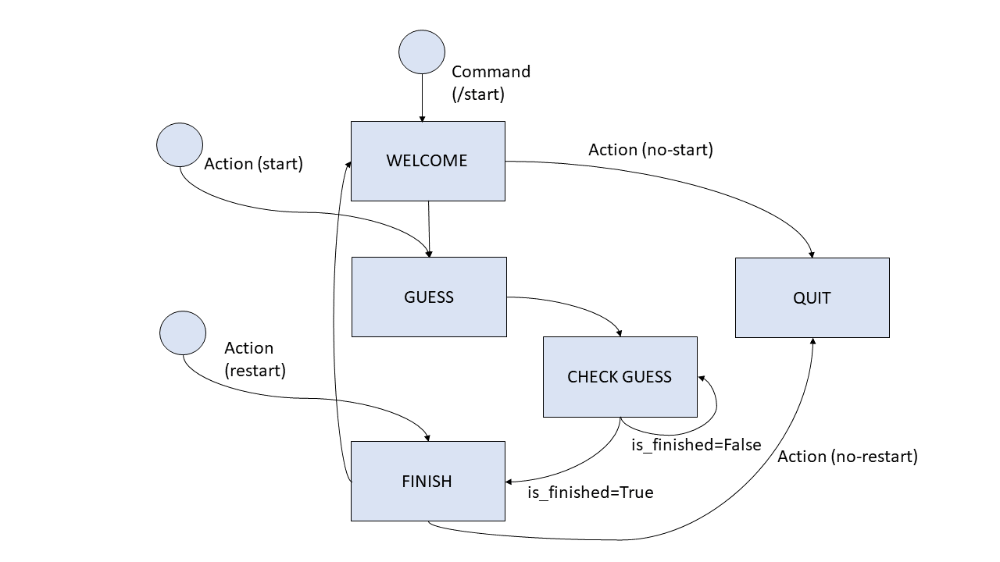

# Rocket Launch

Welcome to Rocket Launch Telegram Bot!

## Description

We have a video of a rocket launch and we want to know at which frame exactly is the rocket launched using a **Telegram Bot** and the **BERNARD** framework.

## Configuration

To run this code it is higly recommended to follow the next steps
1. Use a virtual environment suchs as **Virtualenv**. Configure the environment with **Python3.6** and **Pip=9.0.3**
2. Install Bernard in the environment. If you require help to continue, please refer to [BERNARD's documentation](https://github.com/BernardFW/bernard). 
3. A Redis database is required, so it will be necessary to start it using  `redis-server`
4. The bot needs a Public URL. **Ngrok** is the solution `./ngrok http 8443`. Note: Port 8443 is one of the available ports for Telegram. 
5. Create your Bernard project:
  -  `bernard start_project rocket_launch ./dev/rocket_launch`
6. Create your Bot using BotFather in Telegram [Telegram Bot's documentation](https://core.telegram.org/bots) 
7. Configure you env file:
  - Set the **TELEGRAM_TOKEN** token obtained from BotFather (mandatory to use that name)
  - Set the **BIND_PORT**=8443 Use one of the ports abailable for Telegram
  - Set the **BERNARD_BASE_URL** (the public URL from Ngrok)
8. Run the program. In the main folder, run the commands
  -  `source ./env`   
  -  `./manage.py run`
  
And that's it! You should be able to use your bot. 
  
## System description

1. Inside the rocket_launch/src folder we can find the following: 

* **states.py**: Defines all the possible states that our Finite State Machine can perform. 
* **transitions.py**: Defines all the possible transitions between states in or FSM
* **frames.py**: Useful methods to obtain frame information. 
* **bisection.py**: Performs the bisection for the new frame
* **environment.py**: Contains the Video Variables.   
* **trigger.py**: Detects when the guessing is done using `is_finished`parameter. Once the guessig is finished the result is displayed.  

2. Inside the i18/end folder we can find the following:
* **intents.csv**: File for understanding possible different answers from the user  
* **responses.cv**: Contains all the pre-defined responses for our bot.   
